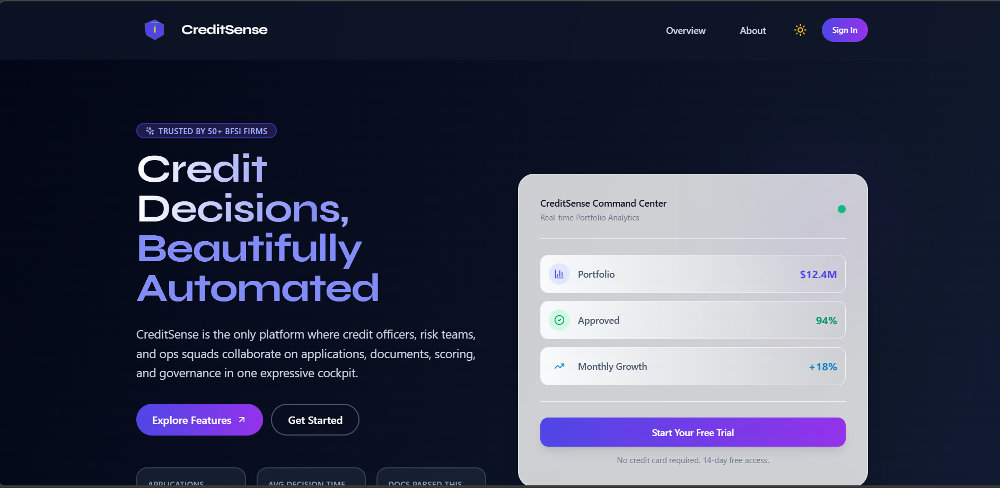
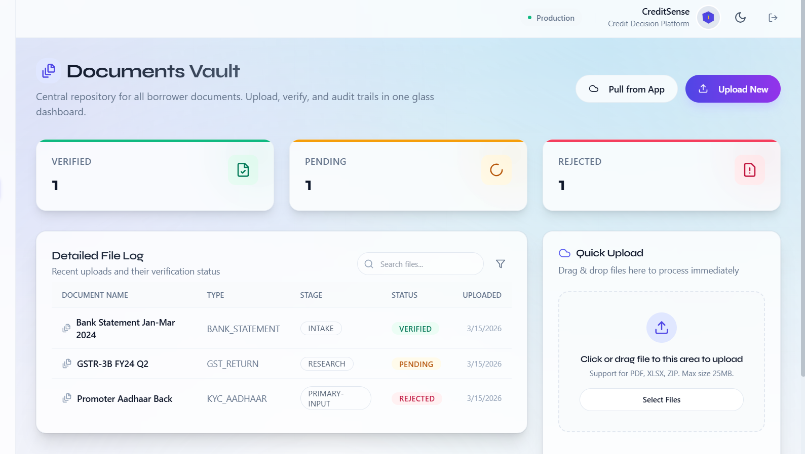
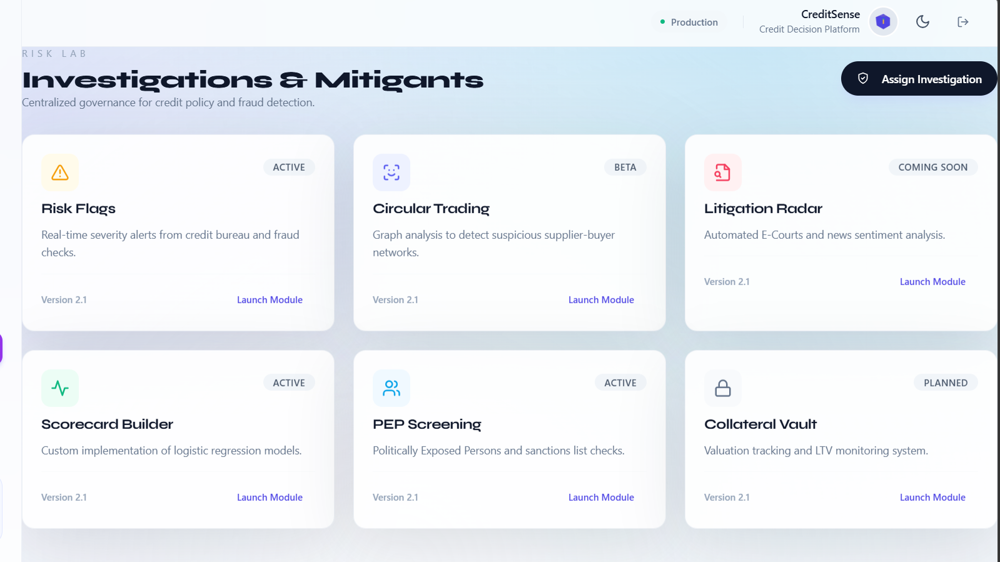

# Aurora Credit OS
## Comprehensive Platform Documentation

 

## 1. Executive Summary

When we set out to build Aurora Credit OS, we had a simple question:  

Traditional credit decisioning is bogged down by fragmented spreadsheets, manual document parsing, and black-box scoring systems that underwriter committees struggle to trust. We built Aurora to fix this. It is a sophisticated, AI-driven credit decision engine that significantly accelerates credit decisions from weeks down to hours. 

By combining rigorous institutional risk standards with cutting-edge explainable AI (XAI) models, we provide banking and lending teams with a cohesive, highly responsive platform. This document outlines the functional prototype of the Aurora platform, demonstrating how our specialized modules coalesce into a seamless, confident credit appraisal journey.

## 2. Platform Modules & Interface

### 2.1 The Front Door: Homepage & Onboarding

First impressions matter. We designed the Aurora platform to immediately welcome users with a sleek, high-conversion landing page that cuts through the noise and outlines our exact capabilities. It tracks mission-critical metrics—such as average decision time and total documents parsed—while offering a frictionless pathway to user registration.

We obsessively optimized the onboarding process for speed. Utilizing client-side prefetching and an ultra-fast automated setup logic, new credit officers and risk managers instantly transition from registration directly into the active ecosystem, ready to work.

### 2.2 The Command Center: Executive Dashboard

Every operations leader needs a single source of truth. Our Executive Dashboard serves as the financial pulse of the organization. From this centralized view, executives and credit managers can gauge the overall health of their portfolios in real time. 

We present critical insights—such as Portfolio Exposure, Approved Ratios, and Monthly Growth—through highly readable visual components and dynamically rendered statistical scorecards. Furthermore, every widget on this dashboard acts as a gateway; a single click allows leaders to drill down into deeper analytics, ensuring that actionable insights are always immediately available.

### 2.3 Comprehensive Application Management

We recognized that credit teams waste countless hours managing disjointed loan trackers. Aurora entirely replaces fragmented spreadsheets with an orchestrated Application Management hub. This module meticulously tracks every loan request as it traverses across the multi-stage approval pipeline—from initial Screening to Underwriting, and finally to Committee approval.

Critical information, such as applicant identity, funding requirements, internal priority levels, and real-time processing statuses, are seamlessly organized. Credit teams leverage this interface to distribute workloads gracefully, preventing bottlenecks and continuously monitoring individual application health scores.

### 2.4 Document Processing Hub

One of our clients' biggest pain points is the sheer volume of unstructured data. Aurora solves this with a highly automated Document Processing Hub that ingests chaotic financial data and instantly transforms it into structured, actionable intelligence. 

Our hub securely handles bulk asynchronous uploads—including complex GST records, bank statements, and ITRs. As files are uploaded, our proprietary Machine Learning algorithms run in parallel to extract key financial parameters effortlessly. We've included clear progress bars and verification tags (e.g., OCR completion, NLP parsing success) so that underwriters can trust the automation, turning historically manual data entry into strictly supervised, automated orchestrations.

### 2.5 Entity & Company Intelligence

We know that a safe credit decision requires more than just a rudimentary background check. The Company Intelligence module creates a 360-degree knowledge graph for every prospective corporate borrower. 

Aurora actively knits together regulatory registry findings, ongoing litigation risks, market sentiment, and historical internal data into an expansive corporate profile. This guarantees that underwriters aren't just looking at a static snapshot; they are deeply understanding the enterprise network, ownership structures, and historical relationships of their corporate clients before approving high-value facilities.

### 2.6 Risk, Compliance & Anomaly Tracking

Protecting the institutional balance sheet is non-negotiable. Aurora ships with a robust governance layer dedicated to identifying and mitigating exposure to toxic entities. 

This module continuously runs background processes to track blacklist compliance, trigger warnings for interconnected or circular trading rings, and isolate deep document anomalies. Built strictly for modern compliance standards, it guarantees that potential fraud vectors are explicitly halted before they enter deeper underwriting stages.

### 2.7 The Score Studio: Explainable AI in Action

At the very heart of our engine is the Advanced Score Studio. We built this to solve the industry's hesitance around AI: . Aurora breaks down complex AI-driven predictions into the universally recognized "Five-C" framework (Character, Capacity, Capital, Collateral, and Conditions). 

Rather than simply spitting out a blind rating, our scoring system meticulously explains its reasoning. It explicitly isolates the specific mathematical drivers and mitigants behind every rating. This transparency not only builds immense trust with underwriting committees but also automatically injects those exact insights directly into auto-generated Credit Appraisal Memos (CAMs), drastically reducing final review cycles.

 

   
  

