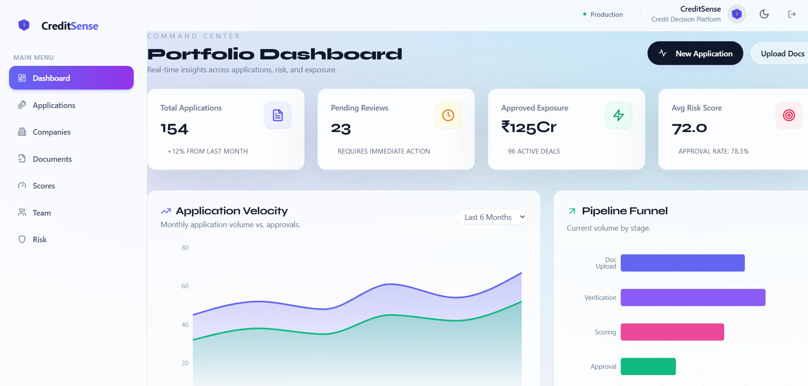
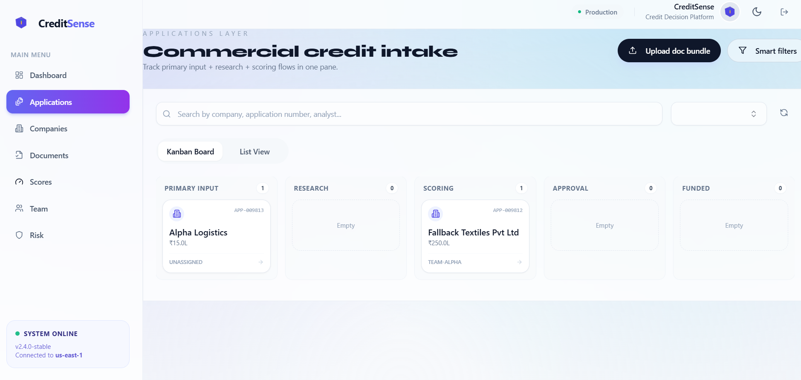
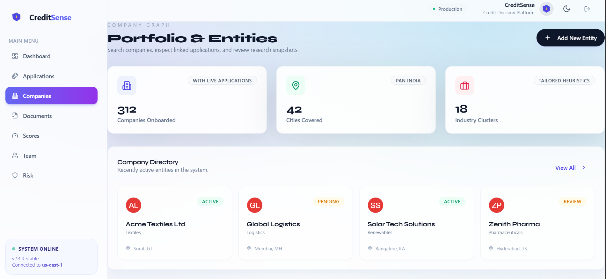
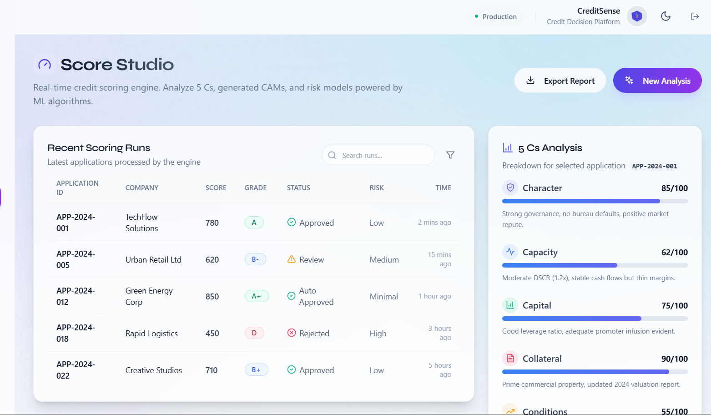

# 🌟 Aurora Credit OS
## The Future of Credit Decisioning
**Prototype Showcase & Technical Documentation**

---

<p align="center">
  <em>A state-of-the-art intelligent credit decision platform designed for BFSI firms, automating credit assessments, risk evaluation, and application workflows using next-generation AI and financial modeling.</em>
</p>

---

### 📑 Table of Contents
1. [Platform Overview](#1-platform-overview)
2. [Product Interface Showcase](#2-product-interface-showcase)
   - [Command Overview (Dashboard)](#21-command-overview-dashboard)
   - [Application Management](#22-application-management)
   - [Company Intelligence](#23-company-intelligence)
   - [Document Processing Hub](#24-document-processing-hub)
   - [Risk & Compliance Evaluation](#25-risk--compliance-evaluation)
   - [Dynamic Score Studio](#26-dynamic-score-studio)
3. [Core Technical Architecture](#3-core-technical-architecture)
4. [Deployment Details](#4-deployment-details)

---

## 1. Platform Overview 🚀
Aurora Credit OS reduces credit decision cycles from weeks to hours, transforming legacy workflows into highly orchestrated, data-rich processes.

**Key Value Propositions:**
- **Zero Document Chaos:** Fully automated ingestion and tagging.
- **Explainable Analytics:** 5C modeling (Character, Capacity, Capital, Collateral, Conditions).
- **Compliance Ready:** Unalterable audit logs and RBAC security models.

---

## 2. Product Interface Showcase 🖥️

Below are visual insights into the Aurora Credit OS, highlighting key functional modules.

### 2.1 Command Overview (Dashboard)
The centralized cockpit for real-time visibility into your entire credit portfolio. 
Tracks exposure, processing speed, and approval bottlenecks at a glance.



*Key Highlights:*
- Real-time pipeline status 
- Aggregate exposure metrics
- Task assignments and pending actions

---

### 2.2 Application Management
Complete tracking of every loan request traversing the approval pipeline.



*Key Highlights:*
- Stage-gated workflows (Screening, Underwriting, Committee, etc.)
- Multi-lane processing for fast-tracking reliable borrowers
- Intuitive filtering and tagging

---

### 2.3 Company Intelligence
A 360-degree view of borrowing entities. This builds an intelligence graph stitching together KYC, sentiment, and financial history.



*Key Highlights:*
- Deep integration with regulatory registries
- Corporate hierarchies and UBO tracing
- Credit footprint evaluation

---

### 2.4 Document Processing Hub
An automated bay where chaotic financial documents are securely validated and parsed.


*Key Highlights:*
- Secure GST, Bank Statement, and ITR ingestion
- Auto-tagging of unstructured data
- Machine learning extraction pipelines

---

### 2.5 Risk & Compliance Evaluation
Automated anomaly detection and robust governance controls safeguarding your portfolio.


*Key Highlights:*
- Fraud ring detection (e.g., circular trading alerts)
- Blacklist screening and regulatory checks
- Deep anomaly alerts on uploaded document sets

---

### 2.6 Dynamic Score Studio
Where raw numbers meet the "Five-C" framework. Transparent logic allows credit officers to accept or challenge AI-generated ratings.



*Key Highlights:*
- IIT-grade ML risk modeling integration
- Granular breakdown of score drivers and mitigants
- Automatic CAM (Credit Appraisal Memo) generation

---

## 3. Core Technical Architecture ⚙️

The system is meticulously decoupled, relying on modern patterns for extreme scalability.

- **Frontend Ecosystem:** Next.js 14, React 18, Tailwind CSS, Lucide Icons
- **Backend Services:** Node.js 24.x, Express API, Prisma ORM
- **Database Engine:** PostgreSQL (Transactional), MongoDB (Doc Storage, Schema-less Templates)
- **Security:** Advanced JWT verification, granular session lifetimes, Bcrypt hashing.

---

## 4. Deployment Details 🚢

The Aurora Credit OS prototype can be spun up in containerized environments effortlessly.

```bash
# Start required databases
docker-compose up -d

# Backend Launch
cd backend
npm install && npx prisma generate && npx prisma db push
npm start

# Frontend Launch 
cd frontend
npm install
npm run dev
```

---
*Generated by Aurora Credit OS Documentation Engine — March 2026*
